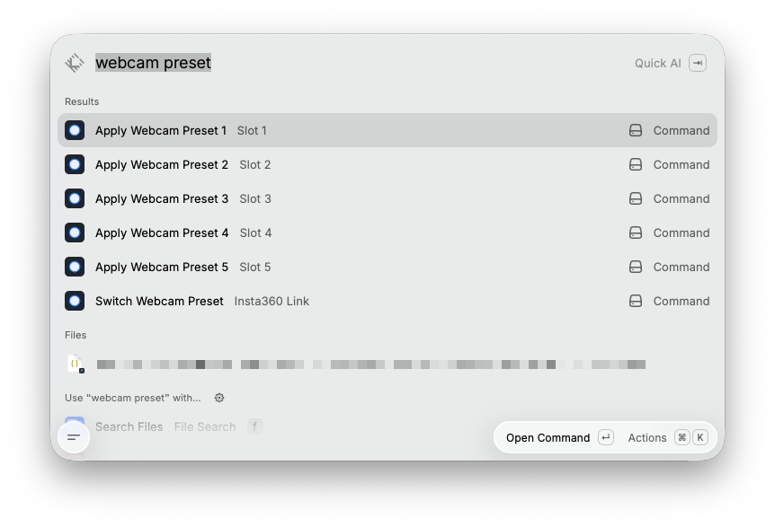

# Insta360 Link Preset Switcher

A [Raycast](https://raycast.com) extension to switch your **Insta360 Link** webcam between saved scene framings (pan / tilt / zoom) in one keystroke — no more digging through the slow official app.




Insta360 doesn't ship an SDK for the Link, and its "scene presets" live in the camera's app. But the Link is a **standard UVC camera** that exposes absolute pan/tilt/zoom controls — so a framing is fully described by a `(pan, tilt, zoom)` triple. This extension captures those triples and re-applies them via [`uvc-util`](https://github.com/jtfrey/uvc-util), giving you fast, repeatable preset switching from Raycast.

> **macOS only.** It talks to the camera over USB/IOKit through `uvc-util`.

## Features

- 🎬 **Switch presets from a searchable list** — arrow to one, press `Enter`, the camera moves.
- ⌨️ **Global hotkeys** — five "Apply Webcam Preset N" commands you can bind to keys for instant switching.
- 📸 **Capture the current framing** as a new preset, with a pickable icon.
- ✏️ **Edit, reorder, and delete** presets in place.
- 🎯 **Exact & repeatable** — captured values are snapped to the camera's step grid so a preset reproduces its framing precisely.

## How it works

The Insta360 Link implements the standard UVC `pan-tilt-abs` and `zoom-abs` camera-terminal controls. `uvc-util` reads and writes those over USB. A "preset" is just the stored `(pan, tilt, zoom)` values; applying one issues two `uvc-util` set commands. Presets are stored locally in Raycast (`LocalStorage`) — nothing leaves your machine.

## Requirements

- macOS with [Raycast](https://raycast.com) installed
- [Node.js](https://nodejs.org) 22+ and npm
- Xcode Command Line Tools (`xcode-select --install`) to build `uvc-util`
- An Insta360 Link (tested on **Link-1PV8WS**)

### 1. Build `uvc-util`

```bash
git clone https://github.com/jtfrey/uvc-util.git
cd uvc-util/src
gcc -o uvc-util -framework IOKit -framework Foundation uvc-util.m UVCController.m UVCType.m UVCValue.m
cp uvc-util /usr/local/bin/          # or any absolute path you set in preferences
```

Verify the camera is visible and exposes PTZ:

```bash
uvc-util -d                          # should list "Insta360 Link"
uvc-util -N "Insta360 Link" -c       # should include pan-tilt-abs and zoom-abs
```

### 2. Turn AI tracking OFF

In the Insta360 app, disable AI tracking. While it's on, the camera continuously re-aims and will fight/override any manual position you apply.

## Install the extension

This is an unpublished/local extension — run it straight from source:

```bash
git clone https://github.com/productgabi/raycast-insta360-link-preset-switcher.git
cd raycast-insta360-link-preset-switcher
npm install
npm run dev        # builds and loads it into your local Raycast
```

`npm run dev` imports the extension into Raycast (it stays available afterwards; stop the watcher with `Ctrl+C`). For a permanent local build, use `npm run build`.

Then open **Raycast → Extensions → Insta360 Link Preset Switcher** and, if the defaults don't match your setup, set:

| Preference       | Default                   | Notes                                            |
| ---------------- | ------------------------- | ------------------------------------------------ |
| **uvc-util Path** | `/usr/local/bin/uvc-util` | Absolute path — Raycast doesn't inherit your `PATH`. Apple Silicon Homebrew users often use `/opt/homebrew/bin`. |
| **Camera Name**  | `Insta360 Link`           | The device name from `uvc-util -d`.              |

## Usage

- **Switch Webcam Preset** — searchable list of presets. `Enter` applies the highlighted one.
  - `⌘N` — **Save current position as preset.** Frame the camera how you want (in the Insta360 app or by any means), then capture it here and pick an icon. Repeat for each framing you use.
  - `⌘E` edit (name + icon) · `⌘⌥↑/↓` reorder · `⌃X` delete.
- **Apply Webcam Preset 1–5** — no-view commands that apply the 1st–5th preset (by list order). Assign a **global hotkey** to each in Raycast for one-keystroke switching. Reorder presets in the list to change which slot they occupy.
  - Raycast command titles are static, so these are numbered by slot. Each command's **subtitle** updates to the applied preset's name once you run it (and is searchable). You can also set a custom per-command alias in Raycast Settings → Extensions.

## Scope & limitations

- **Framing only.** Pan/tilt/zoom are restored exactly. Image settings (HDR, AI tracking mode, DeskView/Whiteboard, full exposure) are **not** — those live in Insta360's proprietary UVC Extension Unit and aren't part of standard PTZ.
- Zoom is digital, 1.00×–4.00× (`zoom-abs` 100–400). Pan/tilt units are arcseconds (step 3600 ≈ 1°); ranges pan ±522000, tilt −324000…360000.
- `uvc-util` sends control transfers while the camera is in use by other apps, so presets work mid-call.

## Troubleshooting

- **"uvc-util not found"** — set the correct absolute path in the extension preferences (see the table above).
- **Camera not found / wrong device** — run `uvc-util -d` and copy the exact device name into the **Camera Name** preference.
- **Preset applies but the camera drifts back** — AI tracking is still on; disable it in the Insta360 app.
- **Nothing moves** — confirm `uvc-util -N "Insta360 Link" -c` lists `pan-tilt-abs`/`zoom-abs`; ranges can vary by model/firmware (Link vs Link 2 vs 2C), check with `uvc-util -N "Insta360 Link" -S pan-tilt-abs`.

## Credits

- [`uvc-util`](https://github.com/jtfrey/uvc-util) by Jeffrey Frey — the UVC control layer this extension shells out to.
- Prior art on Insta360 Link UVC control: [soyersoyer/cameractrls](https://github.com/soyersoyer/cameractrls), [vrwallace/Insta360-Link-Controller-for-Linux](https://github.com/vrwallace/Insta360-Link-1-and-2-Controller-for-Linux), and [jfwoods/insta360link-controller](https://github.com/jfwoods/insta360link-controller).

Not affiliated with or endorsed by Insta360. "Insta360" and "Link" are trademarks of their respective owner.

## License

[MIT](./LICENSE)
